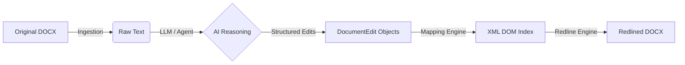

# Project Adeu: Technical Specification

## 1. Architectural Overview

Adeu operates on a **Reference-Based Injection** strategy. Instead of converting a document to an intermediate format (like Markdown) and trying to rebuild it, Adeu keeps the original XML structure intact and surgically injects `w:ins` (insert) and `w:del` (delete) tags.

### The Pipeline



## 2. Component Detail

### 2.1 Ingestion (`src/adeu/ingest.py`)
**Goal**: Provide text to the LLM that maps 1:1 with the underlying XML runs.
*   **Mechanism**: It does *not* use `docx.Paragraph.text`. Instead, it iterates over visible XML runs and concatenates them. This ensures that if the LLM sees a space, that space exists in a run, allowing the mapper to find it later.

### 2.2 The Mapper (`src/adeu/redline/mapper.py`)
**Goal**: Translate linear text offsets into XML elements.
*   **Challenge**: Word splits text arbitrarily (e.g., spellcheck breaks "Agreement" into `<w:r>Agree</w:r><w:r>ment</w:r>`).
*   **Solution**: The Mapper builds a linear index of every `Run` in the document. When an edit targets text at index 50-60, the Mapper identifies exactly which runs (or partial runs) contain that text.
*   **Run Splitting**: If an edit starts in the middle of a run, the Mapper splits the underlying XML element into two sibling runs (`_split_run_at_index`).

### 2.3 The Redline Engine (`src/adeu/redline/engine.py`)
**Goal**: Inject edits into the DOM.
*   **Indexed Editing**: Applies edits in **reverse order** (by index) to prevent index shifting.
*   **Style Heuristics**: When inserting text, the engine checks neighboring runs. If inserting a suffix, it mimics the previous run's style. If inserting a prefix (e.g., "Very " before "Important"), it mimics the next run's style.
*   **Comments**: Uses `CommentsManager` to manipulate the OPC package relationships, creating `word/comments.xml` if it doesn't exist.

### 2.4 The Diff Engine (`src/adeu/diff.py`)
**Goal**: Support "Full Rewrite" workflows.
*   If an Agent rewrites a whole paragraph instead of providing specific edits, the Diff engine compares `Original Text` vs `New Text`.
*   It uses `diff-match-patch` at a **word-level granularity** (encoding words as characters) to ensure changes are semantic (whole words) rather than character jumbles.

## 3. Data Structures

The system relies on the `DocumentEdit` schema defined in `src/adeu/models.py`.

```python
class EditOperationType(str, Enum):
    INSERTION = "INSERTION"
    DELETION = "DELETION"
    MODIFICATION = "MODIFICATION"

class DocumentEdit(BaseModel):
    operation: EditOperationType
    # The exact text to find (or anchor for insertion)
    target_text: str 
    # The new text to apply
    new_text: Optional[str] 
    # Optional comment to appear in the Review pane
    comment: Optional[str]
```

## 4. Project Structure

```text
|-- src/
    |-- adeu/
        |-- server.py           # FastMCP Server Entrypoint
        |-- ingest.py           # Text Extraction (Run-aware)
        |-- diff.py             # Word-level Diffing
        |-- models.py           # Pydantic Schemas
        |-- redline/
            |-- engine.py       # Main Logic / XML Injection
            |-- mapper.py       # Text -> XML Indexing
            |-- comments.py     # OXML Comments Management
        |-- utils/
            |-- docx.py         # Low-level XML Helpers
```

## 5. Known Limitations

1.  **Table Structure Changes**: Adeu can edit text *inside* table cells, but it cannot currently merge cells, add rows, or delete columns via the structured edit interface.
2.  **Complex Field Codes**: Edits inside complex field codes (like automated dates or TOCs) may result in broken fields.
