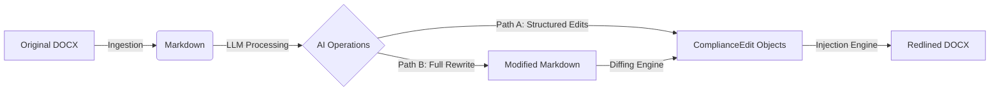

# Project Adeu: Automated DOCX Redlining Engine

## 1. Architectural Overview

Adeu enables a "Round-Trip" workflow for document negotiation without breaking the formatting of the original source file. It solves the "DOCX -> LLM -> DOCX" problem using a **Reference-Based Injection** strategy.

### The Pipeline



## 2. Component Detail

### Phase I: Ingestion (DOCX -> MD)
**Goal**: Convert binary DOCX into semantic Markdown that an LLM can understand and reference.
**Tool**: `MarkItDown` (Microsoft).
*   **Why**: It handles the conversion of tables, lists, and headers into token-efficient Markdown better than standard regex parsers.
*   **Implementation**: `app/services/file_processing.py`.

### Phase II: The Logic Core (LLM & Diffing)
**Goal**: Determine exactly *what* changed.
**Strategy**:
1.  **Structured Output**: The LLM returns a list of `ComplianceEdit` objects.
2.  **Full Rewrite Support**: If the LLM rewrites the document, we use `diff-match-patch` to generate the edits.
    *   *Algorithm*: `diff(Original_MD, New_MD)` -> List of Diffs.
    *   *Conversion*:
        *   `Diff(DELETE, "old")` + `Diff(INSERT, "new")` -> `ComplianceEdit(MODIFICATION, target="old", new="new")`
        *   `Diff(DELETE, "old")` -> `ComplianceEdit(DELETION, target="old")`
        *   `Diff(INSERT, "new")` -> `ComplianceEdit(INSERTION, anchor="preceding_text", new="new")`

### Phase III: The Reconstruction Engines
Adeu supports two distinct output modes.

#### Track A: The Injector (High Fidelity)
**Use Case**: Legal Redlining, Contract Negotiation.
**Constraint**: Must preserve original headers, footers, styles, and numbering.
**Component**: `RedlineEngine` (`app/services/redline/redline_engine.py`).
**Mechanism**:
*   **Normalization**: Uses `normalize_docx` to merge split XML runs, ensuring "contract" is one run, not `["con", "tract"]`.
*   **Mapping**: `DocumentMapper` creates an index of text offsets to XML elements.
*   **Injection**: Surgically inserts `w:ins` (Insertion) and `w:del` (Deletion) tags into the *existing* XML tree.
*   **Formatting Inheritance**: New text automatically inherits the font/size/style of the anchor point.
*   **Comments**: `CommentsManager` handles the OXML complexity of creating `word/comments.xml` and anchoring comments with `w:commentRangeStart/End` tags.

#### Track B: The Generator (Low Fidelity / Visual)
**Use Case**: Summaries, Simple Clean Copies, PDF Reports.
**Component**: `RedlineDocxGenerator` (`app/services/file_processing.py`).
**Mechanism**:
*   Converts Markdown -> HTML -> New DOCX.
*   Uses HTML/CSS classes (`<del>`, `<ins>`) to render visual redlines (colors/strikethrough) but does not use native Track Changes tags.

## 3. Data Structures

The system relies on a strict contract between the LLM/Diff Engine and the Redline Engine.

### 3.1 `ComplianceEdit` Schema
```python
class EditOperationType(str, Enum):
    INSERTION = "INSERTION"
    DELETION = "DELETION"
    MODIFICATION = "MODIFICATION"

class ComplianceEdit(BaseModel):
    operation: EditOperationType
    # The text to find in the document. 
    # For INSERTION, this is the "Anchor" text immediately preceding the insertion.
    target_text_to_change_or_anchor: str 
    # The new text to insert. None for DELETION.
    proposed_new_text: Optional[str] 
    thought_process: Optional[str]
```

## 4. Technical Implementation Status

| Feature | Component | Status |
| :--- | :--- | :--- |
| **Extraction** | `MarkItDown` | ✅ Implemented |
| **Normalization** | `normalize_docx` | ✅ Implemented |
| **Text Mapping** | `DocumentMapper` | ✅ Implemented |
| **Native Redlines** | `RedlineEngine` | ✅ Implemented |
| **Visual Redlines** | `RedlineDocxGenerator` | ✅ Implemented |
| **Text Diffing** | `diff-match-patch` | 🚧 Planned |

## 5. Project Structure

```text
|-- app/
    |-- services/
        |-- ai/
            |-- schemas.py       # ComplianceEdit definition
        |-- redline/
            |-- redline_engine.py # The XML Injector
            |-- document_mapper.py # The Text-to-XML Bridge
            |-- comments.py       # OXML Comments Manager
        |-- file_processing.py    # Ingestion & Visual Generator
|-- tests/
    |-- test_fileprocessing.py
```

## 6. Key Challenges & Solutions

### 6.1 The "Split Run" Problem
**Issue**: Word splits text arbitrarily (e.g., spellcheck breaks a word into two XML nodes).
**Solution**: `DocumentMapper` identifies the start and end nodes of a target phrase. `RedlineEngine` splits the boundary nodes if a match starts in the middle of a node, ensuring precise tagging.

### 6.2 Table & Nested Content
**Issue**: Standard libraries often skip tables.
**Solution**: Recursive traversal (`_search_tables_for_redline`) ensures edits inside cells and nested tables are applied.
